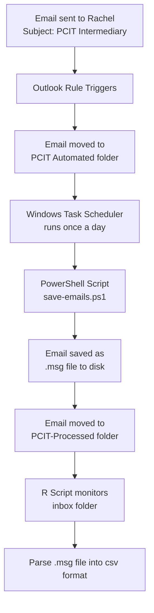

# Email Ingestion
1. When email is sent to Rachel with [PCIT Intermediary] subj
2. It gets automagically moved to folder `PCIT Automated`
3. There's a daily task in task scheduler to run a powershell script `save-emails.ps1`
4. The powershell script saves that email to an .msg file and moves the email to `PCIT-Processed` folder
5. In R process, ingest the message file and process it
6. Save to csv file

# Process diagram

